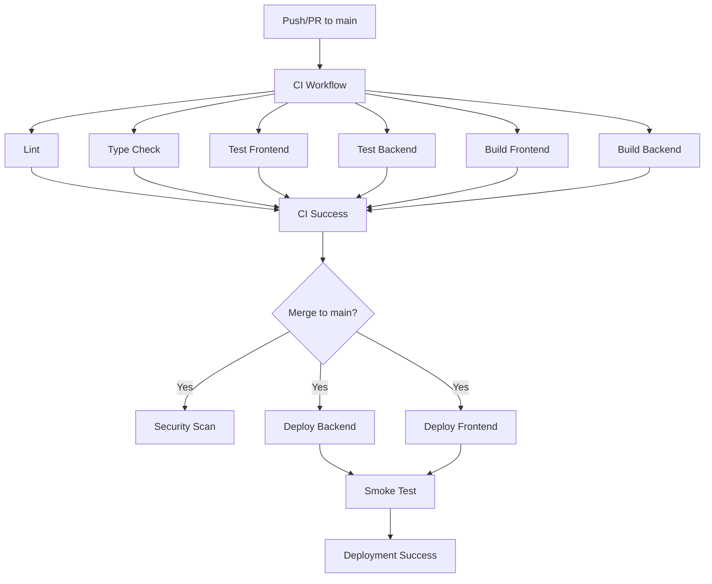
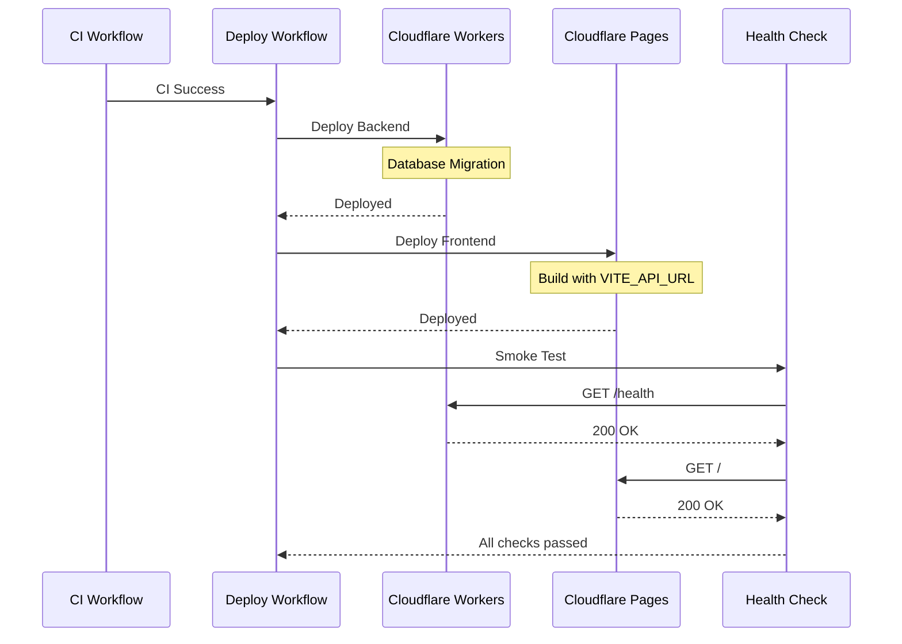

# CI/CDパイプライン設計書

## 概要

ADHD抜け漏れチェッカーのCI/CDパイプラインは、モノレポ構成（frontend/backend）に対応し、TDD開発をサポートします。

## パイプライン構成



## ワークフロー詳細

### 1. CI Workflow (`.github/workflows/ci.yml`)

**トリガー**: Pull Request / Push to main

#### ジョブ一覧

| ジョブ | 説明 | 実行対象 | カバレッジ閾値 |
|-------|------|---------|---------------|
| **Lint** | ESLint実行 | frontend, backend | - |
| **Type Check** | TypeScript型チェック | frontend, backend | - |
| **Test (Frontend)** | Jest単体テスト | frontend | 80% |
| **Test (Backend)** | Vitest単体テスト | backend | 80% |
| **Build (Frontend)** | Viteビルド | frontend | - |
| **Build (Backend)** | Wrangler dry-run | backend | - |
| **CI Success** | 全ジョブ成功確認 | - | - |

#### 並列実行戦略

- **Lint**: Matrix戦略でfrontend/backendを並列実行
- **Type Check**: Matrix戦略でfrontend/backendを並列実行
- **Test**: frontend/backendを個別ジョブで並列実行
- **Build**: frontend/backendを個別ジョブで並列実行

#### カバレッジチェック

```bash
# coverage-summary.jsonから総カバレッジを取得
COVERAGE=$(cat coverage/coverage-summary.json | jq '.total.lines.pct')

# 80%未満の場合は失敗
if (( $(echo "$COVERAGE < 80" | bc -l) )); then
  exit 1
fi
```

### 2. Deploy Workflow (`.github/workflows/deploy.yml`)

**トリガー**: Push to main / Manual dispatch

#### デプロイフロー



#### ジョブ一覧

| ジョブ | 説明 | 依存関係 |
|-------|------|---------|
| **Check CI** | CI完了を待機 | - |
| **Deploy Backend** | Workersデプロイ + DB migration | Check CI |
| **Deploy Frontend** | Pagesデプロイ | Check CI, Deploy Backend |
| **Smoke Test** | ヘルスチェック | Deploy Backend, Deploy Frontend |
| **Notify Success** | デプロイ成功通知 | Smoke Test |

#### 環境変数（Secrets）

| Secret | 説明 | 使用箇所 |
|--------|------|---------|
| `CLOUDFLARE_API_TOKEN` | Cloudflare APIトークン | デプロイ全般 |
| `CLOUDFLARE_ACCOUNT_ID` | CloudflareアカウントID | デプロイ全般 |
| `API_BASE_URL` | バックエンドAPI URL | Frontend build, Smoke test |
| `FRONTEND_URL` | フロントエンドURL | Smoke test |

### 3. Security Scan Workflow (`.github/workflows/security-scan.yml`)

**トリガー**: Pull Request / Push to main / Weekly (Monday 00:00 UTC) / Manual dispatch

#### スキャン項目

| スキャン | ツール | 実行タイミング | 対象 |
|---------|--------|---------------|------|
| **pnpm audit** | pnpm | PR, Push, Weekly | frontend, backend |
| **Dependency Review** | GitHub Actions | PR only | 全体 |
| **Snyk** | Snyk | Push to main | frontend, backend |
| **CodeQL** | GitHub CodeQL | Push to main | frontend, backend |

#### セキュリティポリシー

- **重大度閾値**: High以上の脆弱性で失敗
- **ライセンス拒否**: GPL-3.0, AGPL-3.0
- **PR コメント**: Dependency Reviewの結果を自動コメント

## TDD開発フロー

### Red → Green → Refactor サイクル

```mermaid
graph LR
    A[RED: テスト作成] --> B[Push to branch]
    B --> C[CI: Test Failed]
    C --> D[GREEN: 最小実装]
    D --> E[Push to branch]
    E --> F[CI: Test Passed]
    F --> G[REFACTOR: コード改善]
    G --> H[Push to branch]
    H --> I[CI: All Passed]
    I --> J[Create PR]
    J --> K[Security Scan]
    K --> L[Merge to main]
    L --> M[Deploy]
```



### テスト要件（Issue #01）

#### 単体テスト (`auth.test.ts`)

- ✅ JWT生成・検証
- ✅ OAuth開始エンドポイント
- ✅ OAuthコールバック処理

#### 統合テスト (`auth.integration.test.ts`)

- ✅ OAuth認証フロー全体
- ✅ セッション管理

#### E2Eテスト (`auth.e2e.test.ts`)

- ✅ エンドツーエンド認証フロー

#### セキュリティテスト (`auth.security.test.ts`)

- ✅ JWT検証セキュリティ
- ✅ CSRF保護
- ✅ access_token暗号化

## CI/CD実行タイミングマトリクス

| イベント | Lint | Type Check | Test | Build | Security | Deploy |
|---------|------|-----------|------|-------|----------|--------|
| **PR作成/更新** | ✅ | ✅ | ✅ | ✅ | pnpm audit, Dep Review | - |
| **main へ Push** | ✅ | ✅ | ✅ | ✅ | All scans | ✅ |
| **Weekly (月曜)** | - | - | - | - | All scans | - |
| **Manual** | - | - | - | - | All scans | ✅ |

## モノレポ対応戦略

### pnpm Workspace活用

```yaml
# pnpm-workspace.yaml
packages:
  - 'frontend'
  - 'backend'
```

### フィルター実行

```bash
# Frontend のみ
pnpm --filter frontend <command>

# Backend のみ
pnpm --filter backend <command>

# すべて並列実行
pnpm --parallel --recursive <command>
```

### カバレッジ統合

- Frontend: `frontend/coverage/`
- Backend: `backend/coverage/`
- Codecovに個別フラグでアップロード（`frontend`, `backend`）

## ビルド最適化

### キャッシュ戦略

```yaml
- name: Setup Node.js
  uses: actions/setup-node@v4
  with:
    node-version: '20'
    cache: 'pnpm'  # pnpm-lock.yamlベースのキャッシュ
```

### 並列実行

- Lint, Type Check: Matrix戦略
- Test: 個別ジョブ（frontend/backend並列）
- Build: 個別ジョブ（frontend/backend並列）

### アーティファクト

```yaml
- name: Upload build artifacts
  uses: actions/upload-artifact@v4
  with:
    name: frontend-dist
    path: frontend/dist
    retention-days: 7
```

## デバッグ・トラブルシューティング

### ローカルでCIを再現

```bash
# Lint
pnpm lint

# Type Check
pnpm type-check

# Test with coverage
pnpm test:coverage

# Build
pnpm build
```

### カバレッジが80%未満の場合

```bash
# カバレッジレポート確認
cat frontend/coverage/coverage-summary.json | jq '.total'

# 詳細レポート（HTML）
open frontend/coverage/lcov-report/index.html
```

### デプロイ失敗時の確認事項

1. **Backend デプロイ失敗**
   - Wrangler設定: `backend/wrangler.toml`
   - D1マイグレーション: `pnpm db:migrate:prod`
   - Secrets設定: Cloudflareダッシュボード

2. **Frontend デプロイ失敗**
   - ビルド環境変数: `VITE_API_URL`
   - ディレクトリパス: `frontend/dist`
   - Pages設定: Cloudflareダッシュボード

## 受け入れ基準

- [ ] すべてのCI チェックがパスする
- [ ] カバレッジが80%以上を維持
- [ ] セキュリティスキャンで重大な脆弱性が検出されない
- [ ] デプロイ後のスモークテストがパスする
- [ ] ヘルスチェックが成功する（Backend: `/health`, Frontend: `/`）

## 参考リンク

- [GitHub Actions Documentation](https://docs.github.com/en/actions)
- [pnpm Workspace](https://pnpm.io/workspaces)
- [Cloudflare Workers](https://developers.cloudflare.com/workers/)
- [Cloudflare Pages](https://developers.cloudflare.com/pages/)
- [Snyk Security](https://snyk.io/)
- [CodeQL](https://codeql.github.com/)
