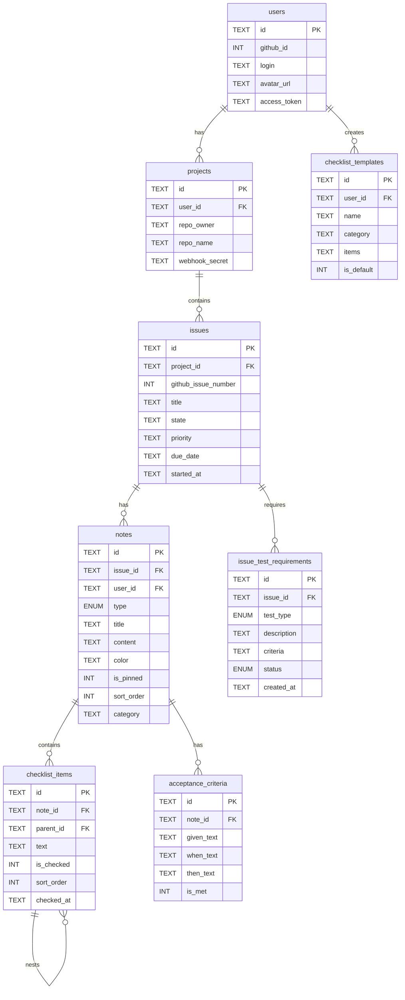
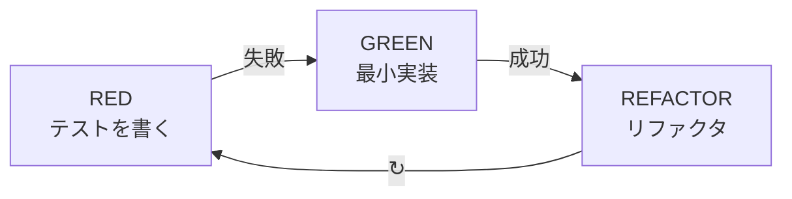

# 抜け漏れチェッカー

**要件定義書 v3 — Masonry UI + TDD + セキュリティ強化**

     

---

## 目次

- [プロジェクト概要](#プロジェクト概要)
- [画面構成](#画面構成)
- [作成モーダル](#作成モーダル)
- [Masonryレイアウト](#masonryレイアウト)
- [ノートカード詳細仕様](#ノートカード詳細仕様)
- [マイクロ進捗チャート](#マイクロ進捗チャート)
- [技術構成](#技術構成)
- [環境変数](#環境変数)
- [データモデル](#データモデル)
- [API設計](#api設計)
- [TDD開発戦略](#tdd開発戦略)
- [Issueごとのテスト要件](#issueごとのテスト要件)
- [セキュリティ & CI/CD](#セキュリティ--cicd)
- [1週間MVPスケジュール](#1週間mvpスケジュール)

---

## プロジェクト概要

### 課題
受託開発の各工程で確認漏れが頻発。ADHDのある開発者にとって複数プロジェクトの並行管理は認知負荷が高い。

### 解決策
Google Keep風のMasonryレイアウトUI + GitHub Issue連携。事前定義テンプレートからチェックリストを自動生成。チェック実行は人間。リスト作成・テンプレート管理・進捗可視化はアプリが担う。

### 技術選定
React SPA (Pages) + Hono API (Workers) + D1。Frontend/Backend完全分離。Jest + React Testing LibraryによるTDD開発。pnpmをパッケージマネージャーとして採用。

### コンセプト
**「付箋を貼るように、チェックリストを並べる。抜け漏れをゼロにする。」**

---

## 画面構成

### 左サイドバー
- Issueごとにカテゴリ分類（クリックでフィルタリング）
- ダブルクリックでカテゴリ名を編集
- 相対時間表示はラベル右側に配置
- 「今日やること」左のアイコンクリックで自動フィルタリング
- **マイクロ進捗メニュー**: クリックで進捗チャート画面へページ遷移
- ゴミ箱（アーカイブ）セクション
- カテゴリ例: Daily Job / Weekly Job / Monthly Job / Tips

### ヘッダー（入力エリア）
- 「メモを入力...」クリックでモーダル展開
- デフォルト入力はテキスト（プレーンテキスト）
- Issue番号でグループ分け（#1, #2, ...）
- 右側アイコンボタン群: テキスト(MD) / チェックボックス / 受け入れ要件(txt or pdf DL可能)

### メインエリア（Masonry）
- メイソンリーレイアウトでノートカード表示
- 固定アイテム（ピン留め）機能
- カラー付きノートカード（黄/橙/緑/青/ピンク）
- 項目がネストできるようにする（ツリー構造）
- 詳細表示ボタン: クリックで全展開

### ノートカード内部
- チェックボックス（テンプレート一括生成 or 通常の手動チェック）
- テキスト（マークダウン対応）
- 受け入れ要件（txt or pdf でDL可能）
- ネスト可能なリスト構造

---

## 作成モーダル

### ノート作成フロー

1. **モーダル起動**: 「メモを入力...」クリック or 「+」ボタン
2. **タイプ選択**: テキスト / チェックリスト / 受け入れ要件 から選択
3. **タイプ別UI**:
   - **チェックリスト選択時**: プリセット4カテゴリから選択 or 全選択 or カスタム作成
   - **テキスト選択時**: マークダウンエディタ表示
   - **受け入れ要件選択時**: Given/When/Then フォーム表示
4. **Issue紐付け**: GitHub Issue番号の選択（任意）
5. **色・カテゴリ設定**: カード色・サイドバーカテゴリ選択
6. **保存**: Masonry上にカードとして即時表示

### チェックリストプリセット選択

| プリセット名 | アイコン | 項目数 |
|------------|---------|--------|
| 受託基本チェック | 📋 | 4項目 |
| 技術チェック | 🔧 | 4項目 |
| 受け入れ要件チェック | ✅ | 4項目 |
| 納品チェック | 📦 | 4項目 |

---

## Masonryレイアウト

Google Keep風のカードベースレイアウト。可変高さのカードを効率的に配置。

### ノートカードタイプ

| タイプ | アイコン | 説明 |
|-------|---------|------|
| テキスト | 📝 | マークダウン対応。見出し・リスト・コードブロック。 |
| チェックリスト | ☑️ | プリセット or カスタム。ネスト対応。進捗バー付き。 |
| 受け入れ要件 | 📄 | Given/When/Then形式。txt/pdf DL可能。 |

### 共通機能
- ピン留め（固定アイテム）
- カラー変更（黄/橙/緑/青/ピンク）
- Issue番号紐付け（#1, #2...）
- ネスト可能なリスト項目
- **各チェックリスト項目にカーソルホバーで子アイテム追加ボタン表示**
- 詳細展開ボタン（クリックで全展開）
- ダブルクリックでインライン編集

---

## ノートカード詳細仕様

### 📝 テキストノート
- マークダウン対応
- 見出し・リスト・コード
- react-markdown で表示
- ダブルクリックで編集

### ☑️ チェックリスト
- プリセット4カテゴリ
- カスタム項目追加可
- ネスト対応（ツリー）
- 進捗バー表示
- ワンタップチェック

### 📄 受け入れ要件
- Given / When / Then
- Gherkin形式入力
- txt / pdf でDL可能
- クライアント共有向け

---

## マイクロ進捗チャート

### ガントチャート ↔ バーンダウンチャート 切り替え表示

#### ガントチャート
Issue単位のタイムライン表示。各Issueの開始日〜期限をバーで可視化。

**機能**:
- Issue単位の横棒表示
- 進捗率のバー内可視化（色分け）
- 期限超過は赤ハイライト
- ドラッグで期限調整（将来実装）

#### バーンダウンチャート
残チェック項目数の推移。理想線 vs 実績線で遅延を検知。

**機能**:
- 理想線（グレー破線）
- 実績線（アクセントカラー）
- 日次の残タスク数プロット
- スプリント期間表示

---

## 技術構成

### Frontend / Backend 完全分離
React SPA (Pages) ↔ Hono API (Workers) を独立デプロイ。CORS + JWT で接続。

### Frontend - React 18 + Vite
**デプロイ**: Cloudflare Pages

- React 18 (SPA)
- React Router v7
- Tailwind CSS v4
- Tanstack Query (データフェッチ)
- Zustand (状態管理)
- @dnd-kit/core (ドラッグ&ドロップ)
- react-masonry-css (Masonryレイアウト)
- recharts (ガントチャート/バーンダウン)
- react-markdown (MD表示)

### Backend - Hono on Workers
**デプロイ**: Cloudflare Workers

- Hono (エッジAPI)
- Drizzle ORM (D1バインディング)
- GitHub OAuth 2.0 (自前実装)
- Octokit (GitHub API)
- Zod (バリデーション)
- hono/jwt (JWT認証)
- pdf-lib (受け入れ要件PDF生成)

### Data & Infra - Cloudflare D1 + KV
**デプロイ**: Cloudflare

- D1 (SQLite — メインDB)
- KV (セッション/キャッシュ)
- GitHub Webhooks受信
- Wrangler CLI (デプロイ)
- GitHub Actions (CI/CD)
- Drizzle Kit (マイグレーション)

### Testing - Jest + RTL
**デプロイ**: TDD

- Jest (テストランナー)
- React Testing Library (コンポーネント)
- MSW (APIモック)
- Testing Library/user-event
- @testing-library/jest-dom
- Hono テスト (app.request)

### Package Manager - pnpm
**デプロイ**: 開発環境

- pnpm (高速・ディスク効率的なパッケージマネージャー)
- workspace機能でモノレポ対応
- ロックファイル (pnpm-lock.yaml)
- 厳格な依存関係管理

---

## 環境変数

### データベース（Cloudflare D1）
- `DATABASE_ID`: D1データベースID
- `DATABASE_NAME`: データベース名（例: `checker_db`）

### GitHub OAuth
- `GITHUB_CLIENT_ID`: GitHub OAuthアプリケーションのクライアントID
- `GITHUB_CLIENT_SECRET`: GitHub OAuthアプリケーションのクライアントシークレット
- `GITHUB_CALLBACK_URL`: OAuthコールバックURL（例: `https://your-domain.com/auth/callback`）

### Cloudflare
- `CF_ACCOUNT_ID`: CloudflareアカウントID
- `CF_API_TOKEN`: Cloudflare APIトークン
- `CF_KV_NAMESPACE_ID`: KVネームスペースID（セッション管理用）

### セキュリティ
- `JWT_SECRET`: JWT署名用シークレットキー（32文字以上推奨）
- `WEBHOOK_SECRET`: GitHub Webhook検証用シークレット
- `ENCRYPTION_KEY`: access_token暗号化用キー（32バイト）

### アプリケーション
- `API_BASE_URL`: バックエンドAPI URL（例: `https://api.your-domain.workers.dev`）
- `FRONTEND_URL`: フロントエンドURL（例: `https://your-domain.pages.dev`）
- `NODE_ENV`: 環境（`development` | `production`）

### 開発環境（オプション）
- `VITE_API_URL`: Vite開発サーバー用API URL
- `PORT`: 開発サーバーポート（デフォルト: 5173）

---

## データモデル

### リレーション
- users 1:N projects
- projects 1:N issues
- issues 1:N notes
- issues 1:N issue_test_requirements
- notes 1:N checklist_items
- notes 1:N acceptance_criteria
- checklist_items → self (ネスト)

---

## API設計

### Auth
| メソッド | パス | 説明 |
|---------|------|------|
| GET | /auth/github | OAuth開始 |
| GET | /auth/callback | コールバック |

### Projects
| メソッド | パス | 説明 |
|---------|------|------|
| GET | /api/projects | 一覧 |
| POST | /api/projects | 登録 |
| POST | /api/projects/:id/sync | Issue同期 |

### Issues
| メソッド | パス | 説明 |
|---------|------|------|
| GET | /api/issues | 一覧（フィルタ/ソート） |
| GET | /api/issues/:id | 詳細 + 関連ノート |

### Notes
| メソッド | パス | 説明 |
|---------|------|------|
| GET | /api/notes | 一覧（カテゴリ/Issue/ピン） |
| POST | /api/notes | 作成（テキスト/CL/受入） |
| PATCH | /api/notes/:id | 更新（色/ピン/並替） |
| DELETE | /api/notes/:id | 削除（アーカイブ) |

### Checklist
| メソッド | パス | 説明 |
|---------|------|------|
| PATCH | /api/checklist-items/:id | チェック状態 |
| POST | /api/checklist-items | 項目追加 |
| PATCH | /api/checklist-items/:id/reorder | 並替/ネスト |

### Templates
| メソッド | パス | 説明 |
|---------|------|------|
| GET | /api/templates | 一覧 |
| POST | /api/templates | 作成 |
| PUT | /api/templates/:id | 更新 |

### Dashboard
| メソッド | パス | 説明 |
|---------|------|------|
| GET | /api/dashboard/stats | 統計 |
| GET | /api/dashboard/gantt | ガントデータ |
| GET | /api/dashboard/burndown | バーンダウンデータ |
| GET | /api/dashboard/leaks | 抜け漏れ一覧 |

### Export
| メソッド | パス | 説明 |
|---------|------|------|
| GET | /api/notes/:id/export/txt | テキスト出力 |
| GET | /api/notes/:id/export/pdf | PDF出力 |

### Test Requirements
| メソッド | パス | 説明 |
|---------|------|------|
| GET | /api/issues/:id/test-requirements | テスト要件一覧 |
| POST | /api/issues/:id/test-requirements | テスト要件作成 |
| PATCH | /api/test-requirements/:id | テスト要件更新 |
| DELETE | /api/test-requirements/:id | テスト要件削除 |

### Webhook
| メソッド | パス | 説明 |
|---------|------|------|
| POST | /api/webhooks/github | 受信 |

---

## TDD開発戦略

### Red → Green → Refactor サイクル

### 原則
- Red → Green → Refactor サイクル厳守
- テストを先に書き、実装は最小限でパスさせる
- 各コンポーネント・APIルートに対応するテストファイル
- カバレッジ目標: 80%以上（ビジネスロジック）

### Frontend テスト
- `NoteCard.test.tsx`: カード表示・ピン留め・色変更・展開/閉じ
- `MasonryGrid.test.tsx`: レイアウト・フィルタ・ソート
- `CreateNoteModal.test.tsx`: モーダル開閉・タイプ切替・プリセット選択
- `ChecklistItem.test.tsx`: チェック/アンチェック・ネスト・並替・ホバー追加ボタン
- `GanttChart.test.tsx`: バー表示・期限超過ハイライト
- `BurndownChart.test.tsx`: 理想線 vs 実績線・データ反映
- `Sidebar.test.tsx`: カテゴリフィルタ・ダブルクリック編集・マイクロ進捗遷移

### Backend テスト
- `notes.test.ts`: CRUD・バリデーション・権限チェック
- `checklist.test.ts`: チェック状態・ネスト・テンプレート適用
- `github-sync.test.ts`: Issue同期・Webhook検証
- `dashboard.test.ts`: 統計計算・ガント/バーンダウンデータ
- `export.test.ts`: txt/pdf生成・フォーマット検証
- `test-requirements.test.ts`: Issue別テスト要件CRUD・ステータス管理

### MSW モック例
- `GET /api/notes` → ノート一覧のモックデータ
- `PATCH /api/checklist-items/:id` → 楽観的更新テスト
- `POST /api/projects/:id/sync` → GitHub同期モック
- `GET /api/issues/:id/test-requirements` → テスト要件モック

---

## Issueごとのテスト要件

各Issue（機能）に対して必要なテスト要件を定義・管理します。単体テスト、統合テスト、E2Eテスト、セキュリティテストの4種類をサポートし、Issue完了前にすべてのテストがパスしていることを確認できます。

### テストタイプ

| タイプ | アイコン | 説明 |
|-------|---------|------|
| unit | 🧪 | 関数・メソッド単位のテスト |
| integration | 🔗 | 複数コンポーネント間の連携テスト |
| e2e | 🌐 | エンドツーエンドのシナリオテスト |
| security | 🔒 | 脆弱性検証・セキュリティチェック |

### テスト要件の管理フロー

1. Issue作成時にテスト要件を定義
2. 各要件にテストタイプ・説明・合格基準を設定
3. テスト実施後、ステータスを `pending` → `passed` / `failed` に更新
4. すべてのテストが `passed` になるまでIssueをクローズしない

---

## セキュリティ & CI/CD

### セキュリティテスト

- `auth.security.test.ts`: 認証・認可のセキュリティテスト（JWT検証、権限チェック）
- `xss.security.test.ts`: XSS対策検証（入力サニタイズ、出力エスケープ）
- `csrf.security.test.ts`: CSRF保護テスト（トークン検証）
- `injection.security.test.ts`: SQLインジェクション対策（パラメータバインディング）

### CI/CDテスト

- `lint`: ESLint + Prettier（コード品質チェック）
- `type-check`: TypeScript型チェック（tsc --noEmit）
- `unit-test`: Jest単体テスト（カバレッジ80%以上）
- `integration-test`: API統合テスト（E2Eシナリオ）
- `security-scan`: 依存関係の脆弱性スキャン（npm audit / Snyk）
- `build-test`: 本番ビルドテスト（Vite build / Wrangler deploy --dry-run）

### CI/CDパイプライン実行タイミング

| トリガー | 実行テスト |
|---------|----------|
| Pull Request | lint + type-check + unit-test |
| Merge to main | 全テスト + security-scan + build-test |
| Deploy | integration-test + E2E |

---

## 1週間MVPスケジュール

### Day 1: 環境 + 認証 + テスト基盤
- Vite + React + Tailwind + Jest + RTL 初期化
- Hono + Wrangler + D1 セットアップ
- Drizzle スキーマ定義 + マイグレーション
- GitHub OAuth 実装（テスト: auth.test.ts 先行）
- MSW セットアップ + テストユーティリティ
- CI: GitHub Actions (lint + test)

### Day 2: GitHub連携 + ノートCRUD
- **RED**: github-sync.test.ts / notes.test.ts 作成
- **GREEN**: Issue取得・保存 / ノートCRUD API実装
- Webhook受信 + HMAC検証
- **RED**: NoteCard.test.tsx 作成
- **GREEN**: NoteCardコンポーネント実装
- **REFACTOR**: 共通コンポーネント抽出

### Day 3: Masonry + モーダル + チェックリスト
- **RED**: MasonryGrid.test.tsx / CreateNoteModal.test.tsx
- **GREEN**: Masonryレイアウト実装（react-masonry-css）
- **GREEN**: 作成モーダル（タイプ選択 + プリセット選択UI）
- **RED**: checklist.test.ts / ChecklistItem.test.tsx
- **GREEN**: チェックリストCRUD + ネスト + テンプレート適用
- プリセット4カテゴリのシードデータ投入

### Day 4: サイドバー + 受け入れ要件 + エクスポート
- **RED**: Sidebar.test.tsx
- **GREEN**: サイドバー（カテゴリフィルタ/ダブルクリック編集/今日やること）
- 受け入れ要件 CRUD（Given/When/Then）
- **RED**: export.test.ts
- **GREEN**: txt / pdf エクスポート（pdf-lib）
- Issue番号によるグループ分け表示

### Day 5: ダッシュボード（ガント + バーンダウン）
- **RED**: dashboard.test.ts / GanttChart.test.tsx / BurndownChart.test.tsx
- **GREEN**: ダッシュボード統計API
- **GREEN**: ガントチャート（recharts BarChart横向き）
- **GREEN**: バーンダウンチャート（recharts LineChart）
- チャート切り替えタブUI
- 抜け漏れ検出ロジック + アラート表示

### Day 6: ADHD配慮UI + 磨き込み
- 視覚的優先度（色分け/バッジ）
- マイクロ進捗アニメーション（チェック時）
- ワンタップチェック最適化
- レスポンシブ対応（モバイル）
- エラーハンドリング・ローディング状態
- **REFACTOR**: テスト追加 + カバレッジ確認

### Day 7: デプロイ + 仕上げ
- Cloudflare Pages / Workers 本番デプロイ
- カスタムドメイン + CORS最終設定
- README + API仕様書
- デモデータ投入・E2E動作確認
- カバレッジレポート確認（≥80%）
- パフォーマンス確認（エッジ応答速度）

---

## ライセンス

MIT

## 作成者

抜け漏れチェッカー開発チーム
# ADHD_youken
